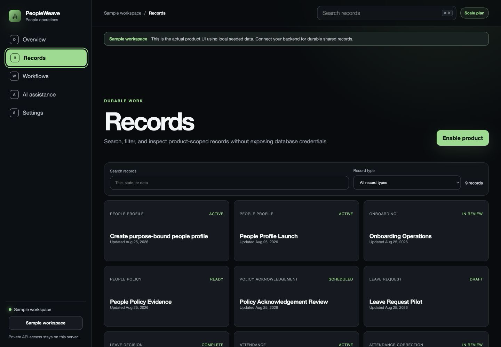

# PeopleWeave

Policies, onboarding, leave, attendance, reviews, and offboarding without automated employment decisions.

PeopleWeave is a focused, public MIT distribution for the `people` module in [managed-oss-cloud](https://github.com/rohanarun/managed-oss-cloud). It includes a product web UI, a product-scoped HTTP client, the `peopleweave` CLI, and a stdio MCP server exposing only this product's 13 typed actions.



## Product v1 boundary

This release is declared-action complete: every typed action in this repository's product manifest is exposed through guided schema-driven browser forms with durable record browsing, workflow groups, AI proposal surfaces, connection settings, CLI parity, and MCP parity. The screenshot above is captured from the actual application in its visibly labeled local sample-workspace mode.

That boundary does not claim feature parity with any unrelated mature third-party product. Provider adapters, external delivery, customer-selected storage, legal review, and other category-specific stop lines remain explicit in the [suite acceptance matrix](https://github.com/rohanarun/managed-oss-cloud/blob/main/docs/product-v1-acceptance.md).

## Current boundary

This repository is runnable, but it is intentionally not a second database server. Authentication, workspace isolation, shared PostgreSQL storage, plan enforcement, AI execution, and audit records remain behind the managed-oss-cloud API. This product receives a scoped API token and cannot receive database credentials or run database migrations.

- Hosted backend: `https://cloud.getsupers.com`
- Self-hosted backend: any compatible managed-oss-cloud v0.4.2 deployment
- Hosted minimum plan: `scale`
- Resource class: `high`
- Pinned backend source: [v0.4.2](https://github.com/rohanarun/managed-oss-cloud/tree/v0.4.2) at `20c4a704c77cbbbff1da995e1d91b937625a8aa4`

## AI-native by construction

- Evidence-cited growth proposals
- Human employment decisions
- Immutable policy and attendance correction receipts

AI actions use their own `ai` token scope, preserve the typed action contract, and return durable backend job evidence. They do not grant the model database credentials or bypass approval, plan, tenant, or action boundaries.

## Run the CLI

Node.js 20 or newer is the only local dependency.

```bash
npm install
npm link
export PEOPLEWEAVE_TOKEN="a-scoped-workspace-token"
export PEOPLEWEAVE_URL="https://cloud.getsupers.com"
peopleweave actions
peopleweave workspace
peopleweave action create-profile '{"employeeRef":"workspace-user-0001","displayName":"Avery","employmentType":"employee","startDate":"2026-09-01","managerRef":"workspace-user-0001","privacy":"people-team","idempotencyKey":"people.create-profile.example-0001"}'
```

The generic `SUPERSUITE_TOKEN` and `SUPERSUITE_URL` variables are supported as fallbacks. Create a token in the workspace dashboard with only the `read`, `write`, and/or `ai` scopes the client needs.

## Run the web UI

The UI proxies requests through the local Node server so the workspace API token is never sent to the browser. Browser access is protected by a separate key of at least 24 characters.

```bash
export PEOPLEWEAVE_TOKEN="a-scoped-workspace-token"
export PEOPLEWEAVE_URL="https://cloud.getsupers.com"
export PEOPLEWEAVE_WEB_KEY="a-separate-random-browser-key"
npm start
```

Open `http://127.0.0.1:4173`. Put the service behind TLS and an authenticated reverse proxy before exposing it to a network.

To explore the complete product UI without a backend account, start the clearly labeled local sample workspace:

```bash
npm run demo
```

Open `http://127.0.0.1:4173` and connect with `sample-workspace-key-2026`. Sample mode is only a UI fixture; backend and persistence acceptance is tested separately against managed-oss-cloud.

Docker runs the same server:

```bash
docker build -t peopleweave:0.2.0 .
docker run --rm -p 4173:4173 \
  -e PEOPLEWEAVE_TOKEN \
  -e PEOPLEWEAVE_URL \
  -e PEOPLEWEAVE_WEB_KEY \
  peopleweave:0.2.0
```

## Connect the MCP server

The MCP server uses newline-delimited JSON-RPC over stdio and implements `initialize`, `ping`, `tools/list`, and `tools/call`. It advertises four product utilities plus the 13 product action tools with their pinned JSON input schemas.

```json
{
  "mcpServers": {
    "peopleweave": {
      "command": "peopleweave-mcp",
      "env": {
        "PEOPLEWEAVE_TOKEN": "a-scoped-workspace-token",
        "PEOPLEWEAVE_URL": "https://cloud.getsupers.com"
      }
    }
  }
}
```

## Self-host the backend

```bash
git clone https://github.com/rohanarun/managed-oss-cloud.git
cd managed-oss-cloud
git checkout v0.4.2
# Follow that repository's PostgreSQL, migration, TLS, and runtime instructions.
```

Then point `PEOPLEWEAVE_URL` at the self-hosted control-plane origin. All products may share the same backend and PostgreSQL cluster while the backend preserves workspace and module boundaries.

## Typed action catalogue

| Action ID | Capability | Token scope | Operation |
|---|---|---|---|
| `create-profile` | Create purpose-bound people profile | `write` | `command` |
| `start-onboarding` | Start approved onboarding | `write` | `command` |
| `publish-policy` | Publish approved people policy | `write` | `command` |
| `acknowledge-policy` | Record policy acknowledgement | `write` | `command` |
| `request-leave` | Request leave | `write` | `command` |
| `decide-leave` | Record human leave decision | `write` | `command` |
| `record-attendance` | Record attendance interval | `write` | `command` |
| `correct-attendance` | Correct attendance with audit | `write` | `command` |
| `open-review` | Open structured review | `write` | `command` |
| `submit-review` | Submit human review | `write` | `command` |
| `propose-growth-plan` | Queue cited growth-plan proposal | `ai` | `ai` |
| `record-access-revocation` | Record verified access revocation | `write` | `command` |
| `offboard` | Record approved offboarding | `write` | `command` |

The complete machine-readable module definition, JSON input schemas, MCP tool names, examples, and release provenance are pinned in [product-manifest.json](./product-manifest.json).

## Clean-room statement

Original clean-room implementation of the people operations software category, designed and written independently. Public category behavior informed the requirements, but the product name, implementation, UI, CLI, MCP surface, tests, and documentation in this repository are original. No third-party product source code, assets, copied interface, trademarks, or branding are included.

## Security

- Use a distinct, least-privilege workspace API token per deployment.
- Never place the API token in browser code, Git history, container images, or logs.
- Keep the web server on loopback unless it is behind TLS and authentication.
- Rotate a token immediately if it is exposed.
- Treat AI output as a proposal unless the action contract explicitly records approval and execution boundaries.

See [SECURITY.md](./SECURITY.md) for vulnerability reporting and the trust boundary.

## Development

```bash
npm test
npm run verify
npm run verify:screenshot
npm pack --dry-run
```

The repository tests prove bearer authentication, fixed module routing, input validation, every declared action's HTTP/CLI/MCP registration, sample-workspace behavior, web-key protection, server-side token handling, and the captured PNG's format and dimensions. Durable backend behavior and tenant isolation remain covered by managed-oss-cloud's PostgreSQL and application acceptance suites.

## License

[MIT](./LICENSE)
